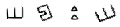

nullcon HackIM 2019: Captcha Forest Harder
=============================

## Description

A harder captcha for you if you felt the first one was too easy

`nc miscc.ctf.nullcon.net 6002`

The server sent us a `png` image in hexadecimal. We have to solve the captcha and output 4 corresponding characters.

This challenge need to be solved 120 times out of 200 tries to output the flag.

The image is a concatenation of 4 characters from the Bill Cipher (a code in Gravity Fall).

This is the harder problem of [Captcha Forest](../Captcha-forest)

The difference is that the image have rotation and scaling over the characters.

#### Example of Captcha with rotation and scaling

## Solution

This is a similiar solution as the previous one. We had the luck to find good enough character to match the code.

Instead of just testing our mapping symbol with the captcha, we combine it with multiple rotations and scalings.

With a family of 30 different rotations {-45, -42, ..., 0 , 3, ... 45} and 5 different scaling, we reach around 95% of accuracy in the captcha. It is enough to recover the flag.

## Code

The code is written [here](script2.py)

The image mapping is stored [here](mapping)

## Flag

`hackim19{I_guess_I_will_stop_making_captchas_now}`