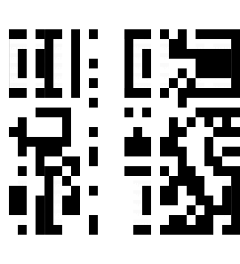

Square CTF 2018: C3 - shredded
==============================

## Description

Instructions to disable C3 were mistaken for an advertisement for new housing on
Charvis 9HD. They’ve been shredded in the final office tidy-up. Nobody bothered
to empty the trash, so a bit of glue and you should be good?

note: flag is in uppercase for this puzzle.

## Solution

The challenge file contains an image cut in 27 vertical strips. The goal is to
use them to reconstruct the original image which contains the flag.

As a first step we can put the images back together in the order we received
them: the result looks like it might be a QR code.

Trying all possible orderings is not feasible but luckily [QR codes have a
a number of alignment patterns that always look the same](http://datagenetics.com/blog/november12013/index.html).

We can guess that the blank strips should be on the sides to match the white
space above and below the code. 5 and 26 contain the vertical edges of the two
big squares on the left side: since only 26 contains the timing marks it must
be the one on the right. We can also identify the center columns of the big
squares on the left (2, 16, 26) and on the right (22, 23, 24) as well as the
ones containing the vertical white strip inside the squares (6, 15 and 1, 18
respectively) and the edges of the right square (8, 14).

However this still leaves a large number of combinations to try, we need to
further narrow down the search space.

We know that according to the QR spec the big squares must be surrounded by
white space. Since we are assuming that the blank strips are outside the code,
there are is only one possibility: 3 to the right of the left squares and 7
to the left of the right square.

We also need a horizontal row of timing marks, and of the 5 strips we have left,
3 have a black dot and 2 a white dot.

With these constraints we're only left with (3!)^3 * (2!)^4 = 3456 possible
codes which is small enough for an exhaustive search.

`GOOD JOB. FLAG-80AD8BCF79`
