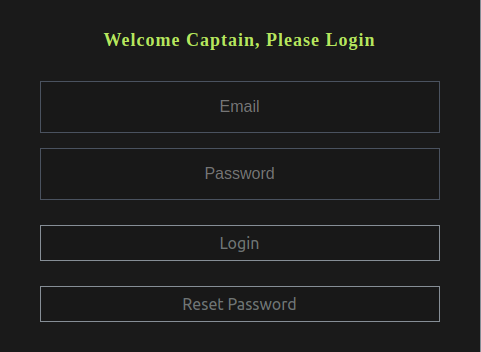
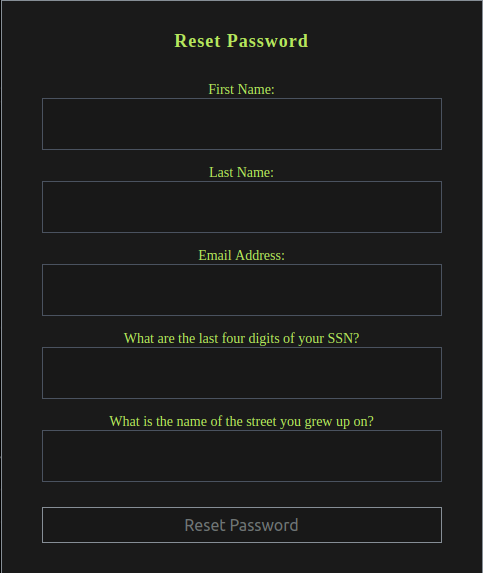
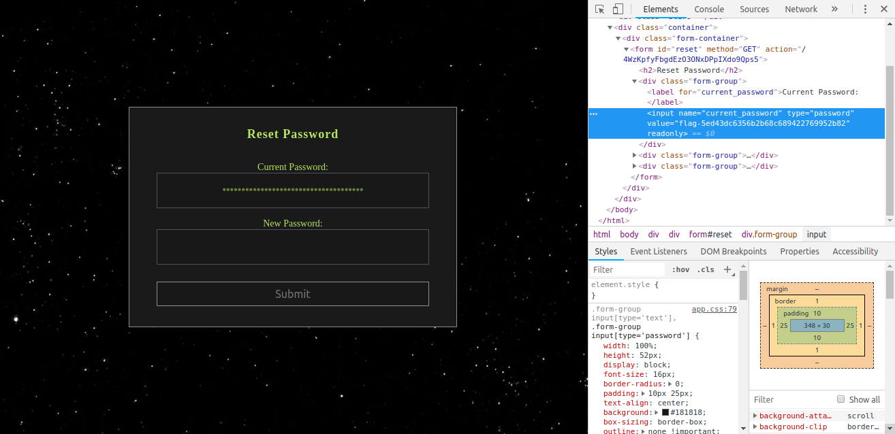

# Square CTF 2018 - C5: de-anonymization

## Description
C5 is an online system and is thus very simple to disable. You just need to login as the Captain Yakubovics. Too bad she’s no longer around to hand you her password.

As luck would have it, you have some anonymized datasets lying around

## Solution

The online system consists of a login page, our goal is to login as _Captain Yakubovics_.



Pressing `Reset Password` shows us a form, asking different personal information.



We have a database composed by 5 different `.csv` file, each files contains different information.

- [1.csv](./data/1.csv): `email, job_title, income`
- [2.csv](./data/2.csv): `email, state`
- [3.csv](./data/3.csv): `ssn_last_four, state, street`
- [4.csv](./data/4.csv): `income, state, street, postal`
- [5.csv](./data/5.csv): `first_name, street`

Let's see if we manage to recover all the information we need to reset the password.

We start knowing `job_tile = Captain` and `last_name = Yakubovics`.

In [1.csv](./data/1.csv) there is exactly one entry that matches `yakubovics`, we obtain
`email = eyakubovics9t@nih.gov` and `income = 96605`.

Now that we know the `income` we can search for `96605` in [4.csv](./data/4.csv). Hopefully, once again, there is only one row matching our query. We collect some new information: `state = Florida`, `street = 4 Magdeline` and `postal = 33421`.

We repeat once again the same procedure, looking for `street` both inside [3.csv](./data/3.csv) and [5.csv](./data/5.csv). In each one of them - as a result - we find only one record. We get
`ssn_last_four = 4484` and `first_name = Elyssa`.

Now we have all the information required to reset the password, so let's do that!

We reach the actual reset page, which shows us the current password as a series of dots. Right click on it, `Inspect`, and we get the flag!

```
flag-5ed43dc6356b2b68c689422769952b82
```


