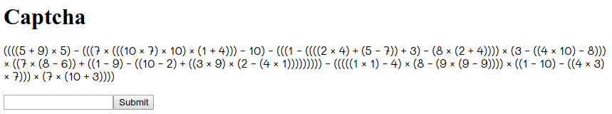

Square CTF 2018: C8 - captcha
=============================

## Description

Charvises (the native species which lived on Charvis 8HD before the first
settlers arrived) were very good at math. In a surprising symbiosis relationship
between humans and Charvises, it was agreed that the Charvises would be
responsible for C8.

Can you pass their CAPTCHA (Completely Automated Public Turing Test to tell
Charvises and Humans Apart)?

## Solution

The challenge page has a CAPTCHA in the form of a simple mathematical expression
which changes every 5 seconds.



However when looking at the page's HTML the text for the above equation is

```
iiiik w xh T kh e iiiK T iiiQS T Kh T QSh T iQ w mhhh e QSh e iiiQ e iiiib T
mh w ik e Khh w Wh e iG T ib w mhhhh T iW e iim T QSh e Ghhh T iiK T iG e shh w
iiQ e xh e iiQS e bh w iiW T xh T ib e im T Qhhhhhhhhh e iiiiiQ T Qh e mh T iG e
ix T ix e xhhhh T iiQ e QSh e iim T Wh T Khhh T iK T iQS w Whhhh
```

The challenge is sending a custom font with the web page which makes `i` look
like `(`, `k` look like `5` and so on... At first we thought we could simply
reconstruct the mapping manually and then feed it to a script but the mapping
between real and displayed characters also changes every 5 seconds.

This seems to be a good use case for OCR but Tesseract was giving us bad results
so we decided to implement our own algorithm. We can manually build a database
of how the font's glyphs look like because they're always the same (only the
mapping between text and glyphs changes), then download the webpage, figure out
what each character is supposed to be (by rendering it and finding the most
similar glyph in our database) and translate the expression to a form that Python
can evaluate.

The algorithm isn't perfect and doesn't work 100% of the time but it generally
succeeds after a few tries which was good enough for us.

`flag-a76013167fd4c04e3134`
