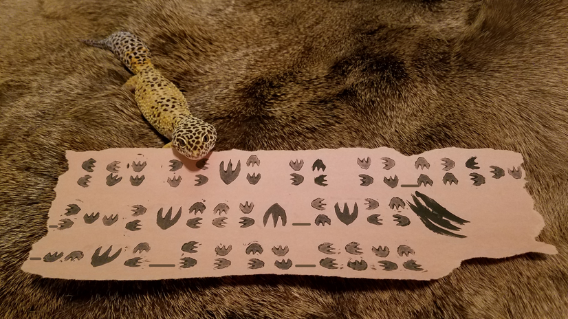
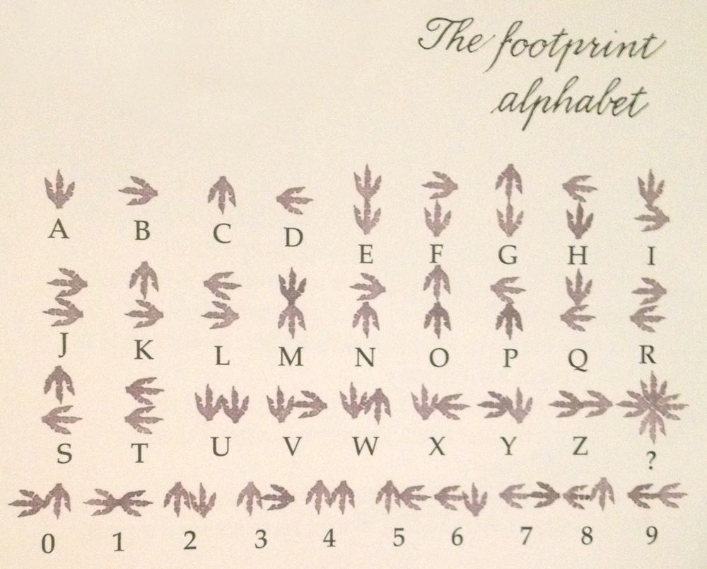

# TU CTF 2018 - Ancient

## Description
Gurney showed me this tablet he found on some far off secret island, but I have no idea what it says... (Standard flag format, letters in all caps) (Difficulty: Normal)



## Solution
It's clear that the picture shows the flag encrypted with a strange footprint alphabet.

One of the first idea we had was that this alphabet is taken from a book or a film. But we kinda gave up after a few random google searches.

Eventually one of us googled [_Gurney secret code_](https://www.google.ch/search?q=Gurney+secret+code&oq=Gurney+secret+code&aqs=chrome..69i57.137j0j4&sourceid=chrome&ie=UTF-8). The first result was the [_Dinotopia_](https://en.wikipedia.org/wiki/Dinotopia) wikipedia page. Find below the first phrase on the page.

_Dinotopia is a fictional utopia created by author and illustrator James Gurney._

At this point we googled [_Dinotopia secret code_](https://www.google.ch/search?ei=H-35W6OhEsOKap-JpqAN&q=Dinotopia+secret+code&oq=Dinotopia+secret+code&gs_l=psy-ab.3...1405.3106..3626...0.0..0.92.151.2......0....1..gws-wiz.......0i71j33i160.V8o09srnuSI). Once again the first result was promising, a page called [_Code of Dinotopia_](http://dinotopia.wikia.com/wiki/Code_of_Dinotopia). In it, a link to the [_Footprint alphabet_](http://dinotopia.wikia.com/wiki/Footprint_alphabet) page.



Decoding out immage we obatain: `THE FLAG IS IF_ONLY_JURASSIC_PARK_WAS_LIKE_THIS`.

We got the flag!

```
    TUCTF{IF_ONLY_JURASSIC_PARK_WAS_LIKE_THIS}
```
