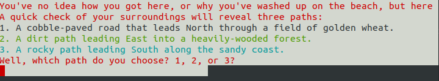
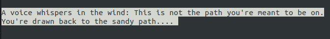
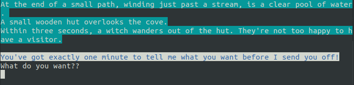
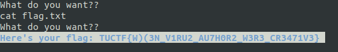

# TU CTF 2018 - easyDOS

## Description
A witch holds the key, but they know some old school tricks. (Difficulty: Normal)

nc 18.217.136.192 12345

## Solution
This challenge implied some guessing and we somehow overthought it at the beginning.

When connecting we see the following text.



No matter which path we pick, the next message will be:



Followed by:



So what do we want? Definitely the flag. But how do we get it? In the end the answer was quite simple...



```
    TUCTF{W)(3N_V1RU2_AU7H0R2_W3R3_CR3471V3}
```

## Techno
Note that the server was infected by [Tecnho](http://malware.wikia.com/wiki/Techno). Once connected, we had only a given amount of time before it was triggered.
