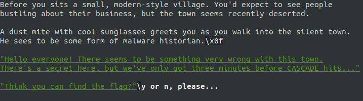

# TU CTF 2018 - hardDOS

## Description
Paying attention is mitey important! (Difficulty: Hard)

nc 18.216.100.42 12345

## Solution
This challenge is similar to [easyDOS](../easyDOS), we have to find the correct commands and arguments.

Also in this case we have to answer some questions before reaching the real challenge.


Let's just pick one of them.



Of course yes!

Now the real challenge starts. Apparently `THE MITE` is giving us some hints.

`"THE MITE: First thing's first. What's even in here?"`

This step was fairly easy, `ls` is working! We got a list of files and a new hint.

`"THE MITE: Alright, seems like a standard DOS installation. One of these files must to have something in it."`

We lost quite a lot of time before discovering that the correct command was `file`. Knowing that we iterate over all files.

`"THE MITE: Hey now, GRAPHICS.COM should be a DOS executable!"`

So `GRAPHICS.COM` is the file we are interested in. Eventually one of us tried to do `strings GRAPHICS.COM`, which gave us the content of the file and the flag!

```
    TUCTF{4LW4Y5_1NF3C7_7H353_19742_BY735}
```

## Code
[flag.py](./flag.py)

## Cascade
Note that the server was infected by [Cascade](http://malware.wikia.com/wiki/Cascade). Once connected, we only had three minutes before it hits.
