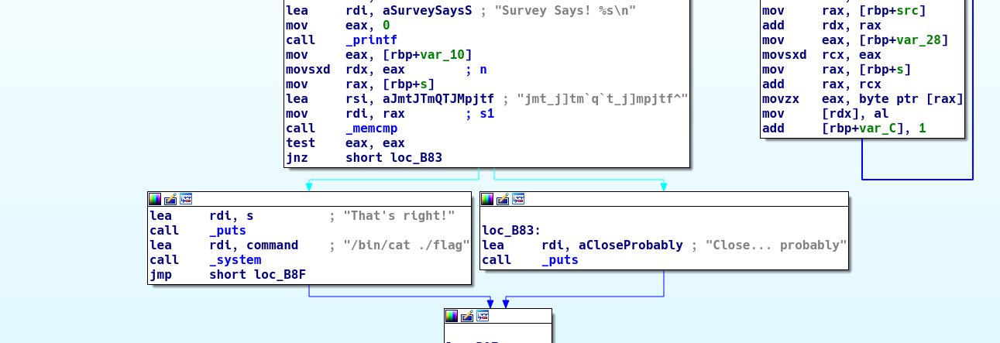

TUCTF 2018: Shoop
=================

## Description

Difficulty: easy

Black Hole Sun, won't you come

and put sunshine in my bag

I'm useless, but not for long

so whatcha whatcha whatcha want?

`nc 18.220.56.147 12345`

## Solution

The challenge binary asks for some input, then prints a message.

```
$ ./shoop
Gimme that good stuff: asdfasdf
Survey Says! ��a_n\a_n\����������
Close... probably
```

With some static analysis we can see that the program first mangles the input in
a way that we'd like not to reverse and then checks it against a fixed string.
If we can find the correct input we will get the flag.



This seems a good use case for [angr](https://angr.io/). We can search for a
state were stdout contains `That's right!`, then print the contents of stdin.

```
$ python solve.py
b'everybodyrockyourbody'
```

Great! Now let's get ourselves a flag!

```
$ echo everybodyrockyourbody | nc 18.220.56.147 12345
Gimme that good stuff: Survey Says! jmt_j]tm`q`t_j]mpjtf^
That's right!
TUCTF{5w337_dr34m5_4r3_m4d3_0f_7h353}
```
