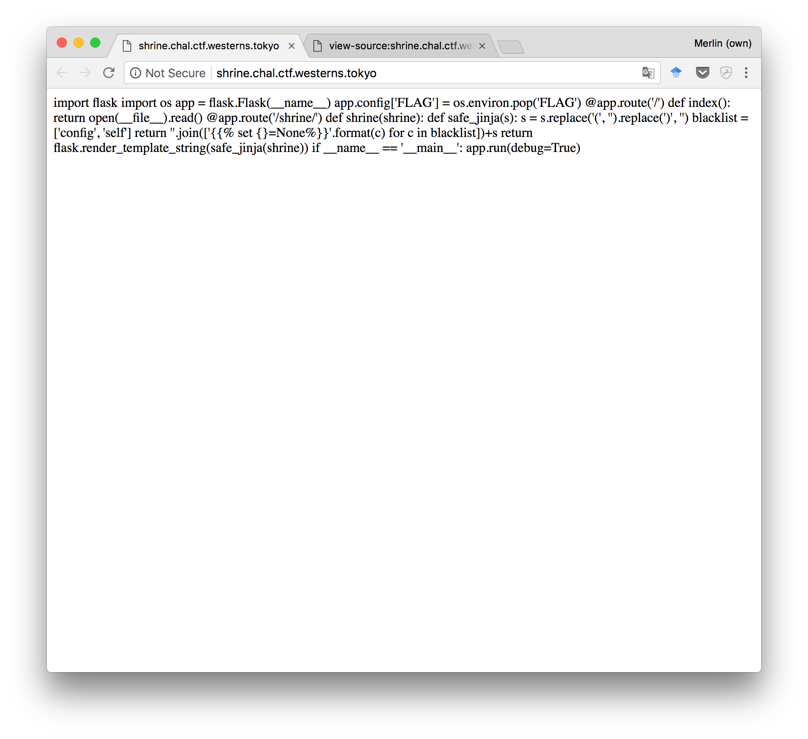
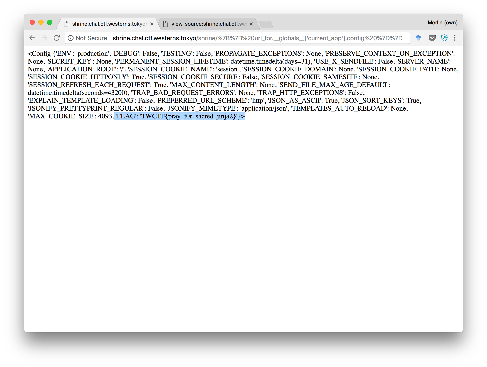

Tokyo Westerns CTF (2018) — shrine
==================================

**Problem**:
> [shrine](http://shrine.chal.ctf.westerns.tokyo/) is translated as jinja in Japanese.


## Opening the challenge



We can see that the challenge kindly provides its own source code. It seems to be a Python script. More precisely, a website written with [Flask](http://flask.pocoo.org/):

```python
import flask
import os


app = flask.Flask(__name__)
app.config['FLAG'] = os.environ.pop('FLAG')

@app.route('/')
def index():
    return open(__file__).read()

@app.route('/shrine/<path:shrine>')
def shrine(shrine):
    def safe_jinja(s):
        s = s.replace('(', '').replace(')', '')
        blacklist = ['config', 'self']
        return ''.join(['{}'.format(c) for c in blacklist])+s
    return flask.render_template_string(safe_jinja(shrine))

if __name__ == '__main__':
    app.run(debug=True)
```

The flag is "right there"! If only we can read `app.config['FLAG']`, the challenge will be solved.

Two pages (routes) are defined: `/` which is the one we've seen, and `/shrine/arbitrary_string`:


At this point, we can already notice a huge XSS vulnerability. But XSS won't take us very far, since we know that the flag is stored in the server's memory, and XSS is a client-side vulnerability.

Let's look more closely at the code rendering this page. Effectively, it does some filtering on the user-provided string `s`:

```python
def safe_jinja(s):
    # Remove parentheses (probably to prevent method calls if we manage to inject code)
    s = s.replace('(', '').replace(')', '')
    # Seems to be using special directives to set some variables to None
    blacklist = ['config', 'self']
    prefix = ''.join(['{}'.format(c) 
                    for c in blacklist])
    # Any output will have this "clearing" prefix, and then our string
    return prefix+s
# Render this "safe" string using Flask's templating engine
return flask.render_template_string(safe_jinja(shrine))
```

## Learning about Shrine

Now that we have a better idea of what's going on, let's learn a bit more about Flask's templating engine. It relies on the [Jinja2 library](http://jinja.pocoo.org/docs/2.10/), which is what the challenge title and hints are referring to.
Usually, a templating language is used to define HTML pages that get filled with contents from e.g. a database.

Looking at the docs, it has many advanced features, such as loops, variables, blocks, macros, etc. We could reasonably expect that one of these will give us access to the flag. Essentially, **we're looking for a way to print a variable from the app's config**.

[From the Flask docs](http://flask.pocoo.org/docs/1.0/templating/#standard-context), we learn that there's a "context" within which the template is evaluated. This means we always have access to the following variables:

- `config`
- `request`
- `session`
- `g`
- `url_for()`
- `get_flashed_messages()`

This first one (`config`) looks very promissing! Unfortunately, it's also the one that was being cleared by the application just before we get to inject our code:

```python
blacklist = ['config', 'self']
prefix = ''.join(['{}'.format(c) 
                  for c in blacklist])
# Results in:
# {}{} my_arbitrary_string
```

## Dead ends

Before detailing the correct solution, I want to emphasize that me and my team spent a long time investigating techniques that turned out to be dead ends.

- What if we could create a new scope (like a block), but that would inherit from the global context, overriding the two `set` directives that are being imposed on us?
- What if we could trick the order in which those Jinja directives are executed, so that our code could print the contents of `config` before it was set to `None`?
- What if we could bypass the parentheses filter by using e.g. UTF-8-style parentheses alternatives?
- What if we could store things in a kind of session or server-side memory, and exploit that to do function calls?
- What if we could first write the template code as a string, including parentheses (e.g. by smuggling them through the query string or some session variables), and then get that code to execute? That might have been possible using [Jinja2 macros](http://jinja.pocoo.org/docs/2.10/templates/#macros), but I couldn't get it to work.

My main takeaway here is: look at the point count (reward) for the challenge and the number of teams that solved it. Could it really be that complicated? Otherwise, try looking for a simpler solution.

## Object traversal

In the end, it was an idea that we had fairly early on that did the trick. Googling around, we quickly learnt about Python's "Method Resolution Order" feature:
In each object, there is an `__class__` member, which describes the object's class (name, docs, static methods, etc). Furthermore, each Class object has an `__mro__` field, which lists parent classes. From there, you can reach back to the `Object` parent class, and potentially list all other classes loaded in the current Python runtime using the `__subclasses__()` method.


But if we try to do just that, with the following payload:

> `{{ g.__class__.__mro__[-1].__subclasses__ }}`
> 
> 🌐 `http://shrine.chal.ctf.westerns.tokyo/shrine/%7B%7B%20g.__class__.__mro__[-1].__subclasses__%20%7D%7D`

The only text we get back is:

```
<built-in method __subclasses__ of type object at 0x7fdc2b3e1820>
```

Of course, that's because the parentheses are being removed! We're getting the function object, but can't call it.
At this point, we started looking for alternative ideas (listed in the previous sections). But when we returned later, we realized that many other objects were available to us in the evaluation context.

Trying them out one by one in a local Python prompt (PDB is useful to drop into a prompt in the context of a larger script), we listed all fields of the available objects:

```
>> [d for d in dir(url_for)]
[ '__class__', ..., '__globals__', ... ]
```

Well, that's interesting!

> `{{ url_for.__globals__ }}`
> 
> 🌐 `http://shrine.chal.ctf.westerns.tokyo/shrine/%7B%7B%20url_for.__globals__%20%7D%7D`


We immediately searched for "flag", "config", and finally, "app". Looking a bit further, it turns out that Flask holds a `current_app` reference, which itself holds the config dictionary we were looking for. All of this, importantly, without relying on method calls.

> `{{ url_for.__globals__['current_app'].config }}`
> 
> 🌐 `http://shrine.chal.ctf.westerns.tokyo/shrine/%7B%7B%20url_for.__globals__['current_app'].config%20%7D%7D`



We got the flag! `TWCTF{pray_f0r_sacred_jinja2}`