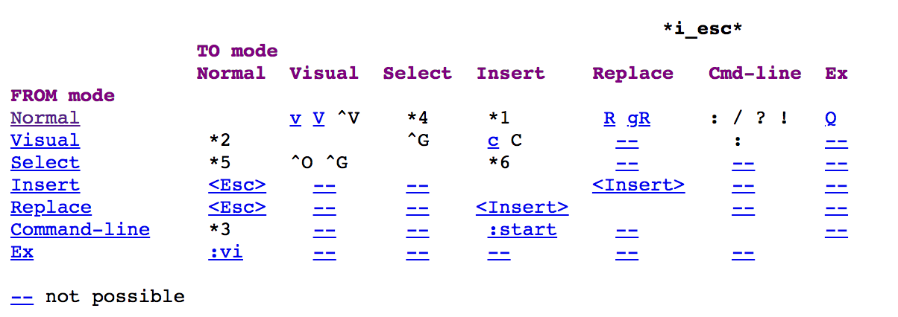
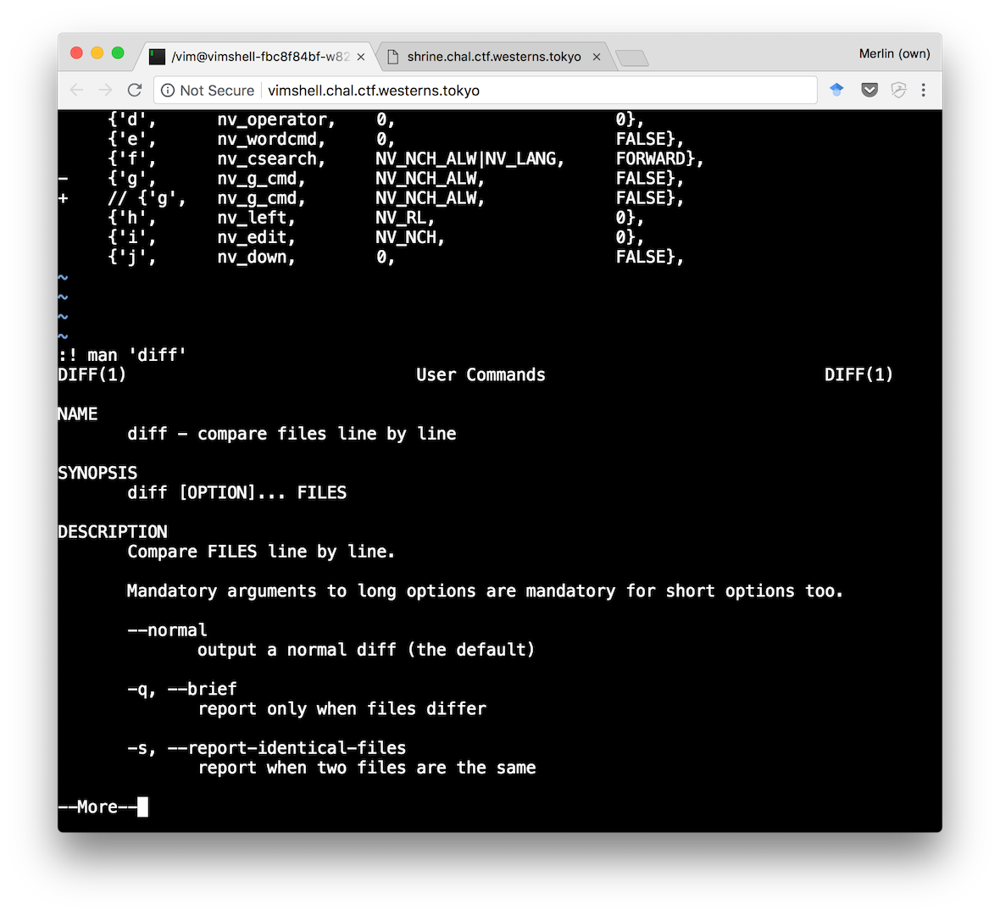
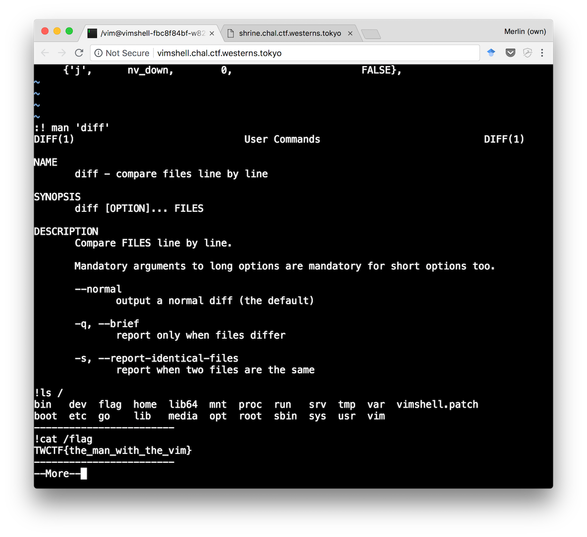

Tokyo Westerns CTF (2018) — vimshell
====================================

**Problem**:
> Can you escape from [jail](http://vimshell.chal.ctf.westerns.tokyo/)?

## Opening the challenge

When opening the challenge, we can see a shell with what looks like a Git diff file shown in the vim editor. The diff shows that the config has been modified to disable the `:`, `Q` and `g` keys. I wasn't sure about usage of `Q` and `g`, but `:` is the way to start all kinds of commands in vim.

## Trying to quit vim

Since I am not a vim power-user, I did a lot of googling to find ways to go around those limitations. From the hint, and the common joke that people always have a hard time quitting vim, I started by looking for ways to exit the editor without `:wq`. I quickly found `shift+ZZ`, but this only resulted in a "Connection closed" message:

## Opening man pages

So it seems that quitting isn't what we're supposed to do. How about executing arbitrary shell commands? I knew that `:!some_command` would execute `some_command` in the shell. But we don't have direct access to command mode (because `:` is disabled).  
In the [vim manual](http://vimdoc.sourceforge.net/htmldoc/intro.html), I looked for other ways to reach command mode, but had no luck:

It didn't seem to be possible to reach command mode in a way that wasn't disabled. That's when I thought:

> Ha, since we can move around and write in this document, would there be a way to execute a command written under the cursor?

So I searched for this and found [this StackOverflow question](https://stackoverflow.com/q/2736085/3792942) which taught me that we can open the `man` page for the word under the cursor with `shift+K`:

Before even going further, I tried again the `!` binding in this new man view. To my surprise, it worked! Since we had a way to execute shell commands, it was easy to locate the flag by looking around the filesystem with `ls`, and printing it wit `cat`.

We got the flag!
`TWCTF{the_man_with_the_vim}`